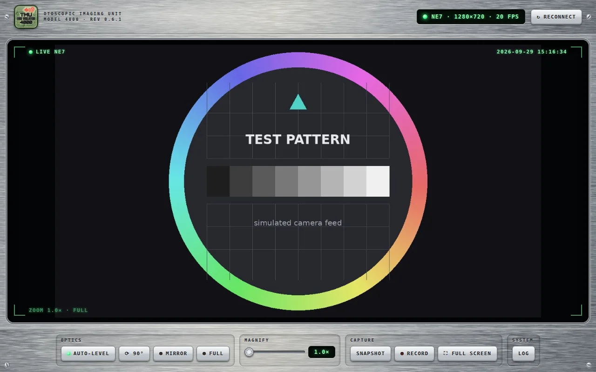

<p align="center"></p>

# Tmu Ear Violator 4000 Streamer

Use your cheap WiFi ear camera without the vendor app.

A viewer for WiFi ear cameras (otoscopes) that broadcast a `HNDEC-xxxxxx`
network and normally need the **"SL ylz"** app. They are sold under many names,
such as "NE3" and "Ear Wax Remover Camera".

**[Project page](https://The-Dorkknight.github.io/ear-violator-4000/)** ·
**[Download for Android](../../releases/latest)** ·
by Matthew Armstrong

<p align="center">
  
</p>

- **No trackers, no ads, no analytics, no accounts.** The app never contacts the internet.
- **Android app** that asks for network access only.
- **Desktop version**: one Python file with no dependencies, for Windows, macOS and Linux.
- Works with both known protocols, **NE3** and **NE7**, and detects which one your scope uses.
- Full-resolution picture by default, with optional Square and Circle views.
- Fullscreen (button, F key or double-click), auto-level from the scope's tilt sensor, mirror, rotate, zoom.
- Snapshots (PNG) and video recording.
- Log panel with one-click diagnostics, plus Reconnect and Restart buttons.

## Licence and disclaimer

Source-available under the **[PolyForm Noncommercial License 1.0.0](LICENSE)**:
free for personal, hobby, educational and other non-commercial use. It is not
an OSI "open source" licence, because commercial use is not permitted.

**No warranty. Use at your own risk.** The author accepts no liability for any
injury, damage or loss. The app shows this notice on first start.

This is a hobby project, **not a medical device**. Don't push the scope further
in than is comfortable, and see a doctor or nurse for pain, discharge, hearing
changes, or wax you can't shift safely.

## Download (Android 10+)

Get the latest `EarViolator4000-x.y.z.apk` from the
[Releases](../../releases/latest) page. Open it on your phone and allow
installing from your browser or file manager when Android asks. Each release
includes `SHA256SUMS.txt`, so you can check the file is the one GitHub built
from this source.

## Use it

1. Turn the scope on: hold the button for 3 seconds.
2. Join its `HNDEC-xxxx` WiFi (no password). If Android warns there's no internet, choose **Stay connected**.
3. Open **Tmu Ear Violator 4000 Streamer**. It finds the scope by itself.

Snapshots go to *Pictures/EarViolator4000* and recordings to
*Movies/EarViolator4000* on Android. See [Troubleshooting](#troubleshooting) if
no picture appears.

## Desktop (Windows / macOS / Linux)

You need Python 3.8 or newer. Nothing else to install.

```sh
python3 src/earscope/ne3web.py
```

Join the scope's WiFi first. A browser tab opens with the picture. A plain
MJPEG stream for VLC or OBS is at `http://localhost:8080/stream.mjpg`.
`python3 src/earscope/ne3web.py --help` lists the options (`--port`,
`--camera-ip`, `--protocol ne3|ne7`, `--no-browser`, `-v`).

## Troubleshooting

| Symptom | Try |
|---|---|
| "Awaiting signal" forever | Check you're on the `HNDEC-xxxx` WiFi, then press **Run diagnostics** in the Log panel. |
| WiFi keeps dropping (Android) | Choose **Stay connected** when Android says the network has no internet. |
| Address already in use | Just run it again: a newer copy replaces the old one. **Restart service** does the same from the UI. |
| Picture is a small box in black | Update to 1.0.0 or later. If it persists, include the log lines `NE7 frame ends:` and `streaming (NE7):` in your bug report. |
| Light ring is dim for a second at power-on | Normal for these scopes; the brightness is not controllable from the app. |

Still stuck? [Open an issue](../../issues/new/choose) and paste the log.

## Build the APK yourself

You need Python 3.10–3.13 and about 5 GB of disk space.

```sh
python3 -m venv .venv
source .venv/bin/activate          # Windows: .venv\Scripts\activate
pip install briefcase
briefcase package android -p debug-apk
```

The APK appears in `dist/`. The first build downloads a private copy of Java
and the Android SDK (5–15 minutes). Publishing your own build on GitHub is
covered in [PUBLISHING.md](PUBLISHING.md).

## Privacy and security

| | |
|---|---|
| Permissions | `INTERNET` and `ACCESS_NETWORK_STATE` only |
| Talks to | the scope on its own WiFi, and itself on `127.0.0.1` |
| Code | two Python files: [`app.py`](src/earscope/app.py) and [`ne3web.py`](src/earscope/ne3web.py) |

The scope's own WiFi has no password: anyone in range can connect while it's
switched on. See [SECURITY.md](SECURITY.md) to report a problem.

## More documentation

- [HOW_IT_WORKS.md](HOW_IT_WORKS.md): protocols, architecture, endpoints
- [CHANGELOG.md](CHANGELOG.md) · [CONTRIBUTING.md](CONTRIBUTING.md) · [SECURITY.md](SECURITY.md)
- [THIRD_PARTY.md](THIRD_PARTY.md): credits and bundled components
- [PUBLISHING.md](PUBLISHING.md): maintainer notes for GitHub, signing and releases

## Credits

Written by Matthew Armstrong. Camera protocols reverse-engineered by the
[haxko hackerspace](https://github.com/haxko/NE3-Scope) (WTFPL). Android app
built with [BeeWare](https://beeware.org). Not affiliated with any camera
maker, seller or app developer; product names are used only to describe
compatibility.
